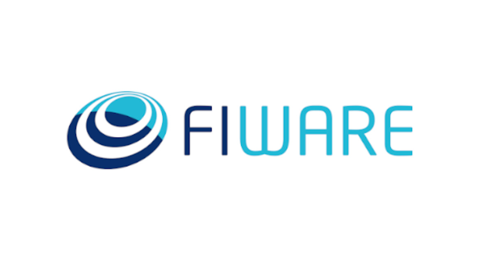

# Asociación de Investigacion en Inteligencia Artificial Para la Leucemia Peter Moss
# HIASCDI - HIAS Contextual Data Interface

   

 

   

&nbsp;

# Introduction

## About

The **HIAS Contextual Data Interface** stores contextual data generated by the HIAS network and exposes it to authenticated data consumers via a REST API. HIASCDI is a Python implementation of a [CEF/FIWARE NGSI v2 Context Broker](https://ec.europa.eu/cefdigital/wiki/display/CEFDIGITAL/Context+Broker). A context broker stores contextual data and serves it to applications by exposing the data through a REST API and pushing notifications through subscriptions.

## Project Status

We are in the process of aligning the HIASCDI context broker with the [CEF/FIWARE NGSI v2 Specifications](https://fiware.github.io/specifications/ngsiv2/stable/), the code availble in this repository does not provide the complete functionality of an NGSI V2 Context Broker and is not yet fully compliant with the NGSI V2 specification.

&nbsp;

# HIAS Core

[HIAS Core](https://github.com/AIIAL/HIAS-Core) is an open-source automation server designed to control and manage an intelligent network of IoT connected devices and applications.

In addition to real-time and historical data, the HIAS network is powered by contextual data. HIAS users, IoT devices, robotics, AI agents and other HIAS compatible projects each have a JSON representation stored in the HIASCDI Context Broker. These JSON representations are made up of contextual data which represent the current state of the physical/virtual entity including configuration and authentication settings.

HIAS devices and applications are the **contextual data producers** for the HIAS network. These devices and applications publish data to the context broker using supported machine to machine communication protocols and the REST API.

HIAS devices and applications are also the **contextual data consumers**. Devices and applications connected to the network consume contextual data generated by the network.

&nbsp;

# Connecting Europe Facility

[Connecting Europe Facility (CEF/CEF Digital)](https://ec.europa.eu/cefdigital/wiki/display/CEFDIGITAL/Context+Broker)

We are proud to be collaborating with the [Connecting Europe Facility (CEF/CEF Digital)](https://ec.europa.eu/cefdigital/wiki/display/CEFDIGITAL/CEF+Digital+Home) for the HIAS/HIASCDI project. CEF is a European Union initiative facilitating the delivery of digital public services across Europe.

With the support and guidance of CEF and FIWARE, we are working towards a full feature and fully compliant Python implementation of an NGSI V2 Context Broker.

Read the CEF (Connecting Europe Facility) [success story](https://ec.europa.eu/cefdigital/wiki/display/CEFDIGITAL/2021/06/15/Context+Broker%27s+contribution+in+the+fight+against+leukemia) on HIAS and the HIASCDI Context Broker.

Watch Association President - [Adam Milton-Barker](https://www.leukemiaairesearch.com/association/volunteers/adam-milton-barker "Adam Milton-Barker")'s presentation at the [CEF Context Broker in action webinar June 2021](https://www.youtube.com/watch?v=ewuIzWcsPK4&t=694s) on the HIAS and the HIASCDI Context Broker.

**Thank you to CEF for the opportunity to speak at this event. Special thanks to Erbil Kop, Regina dela Eva and Caroline Corneau**

&nbsp;

# FIWARE

Through the coillaboration with CEF, we were introduced to [FIWARE](https://www.fiware.org/). The FIWARE Community is an independent Open Community whose members are commited to materialise the FIWARE mission, that is: “to build an open sustainable ecosystem around public, royalty-free and implementation-driven software platform standards that will ease the development of new Smart Applications in multiple sectors”.

Like CEF, FIWARE have very been supportive of our vision, and have helped guide the transition towards a fully compliant NGSI V2 Context Broker. Special thanks to Ken Zangelin from FIWARE who has volunteered considerable hours to assist with technical guidance.

**We would like to thank both CEF and FIWARE for their continued support and guidance.**

&nbsp;

# GETTING STARTED

Ready to get started ? Head over to the [official documentation](docs/index.md) for instructions on how to download/install HIASCDI.

&nbsp;

# Contributing
The Asociación de Investigacion en Inteligencia Artificial Para la Leucemia Peter Moss encourages and welcomes code contributions, bug fixes and enhancements from the Github community.

## Ways to contribute

The following are ways that you can contribute to this project:

- [Bug Report](https://github.com/AIIAL/HIASCDI/issues/new?assignees=&labels=&template=bug_report.md&title=)
- [Feature Request](https://github.com/AIIAL/HIASCDI/issues/new?assignees=&labels=&template=feature_request.md&title=)
- [Feature Proposal](https://github.com/AIIAL/HIASCDI/issues/new?assignees=&labels=&template=feature-proposal.md&title=)
- [Report Vulnerabillity](https://github.com/AIIAL/HIASCDI/issues/new?assignees=&labels=&template=report-a-vulnerability.md&title=)

Please read the [CONTRIBUTING](CONTRIBUTING.md "CONTRIBUTING") document for a full guide to forking our repositories and submitting your pull requests. You will find information about our code of conduct on the [Code of Conduct page](CODE-OF-CONDUCT.md).

You can also join in with, or create, a discussion in our [Github Discussions](https://github.com/AIIAL/HIASCDI/discussions) area.

## Contributors

All contributors to this project are listed below.

- [Adam Milton-Barker](https://www.leukemiaairesearch.com/association/volunteers/adam-milton-barker "Adam Milton-Barker") - [Asociación de Investigacion en Inteligencia Artificial Para la Leucemia Peter Moss](https://www.leukemiaresearchassociation.ai "Asociación de Investigacion en Inteligencia Artificial Para la Leucemia Peter Moss") President/Founder & Lead Developer, Sabadell, Spain

&nbsp;

# Versioning
We use [SemVer](https://semver.org/) for versioning.

&nbsp;

# License
This project is licensed under the **MIT License** - see the [LICENSE](LICENSE "LICENSE") file for details.

&nbsp;

# Bugs/Issues
We use the [repo issues](issues "repo issues") to track bugs and general requests related to using this project. See [CONTRIBUTING](CONTRIBUTING.md "CONTRIBUTING") for more info on how to submit bugs, feature requests and proposals.
